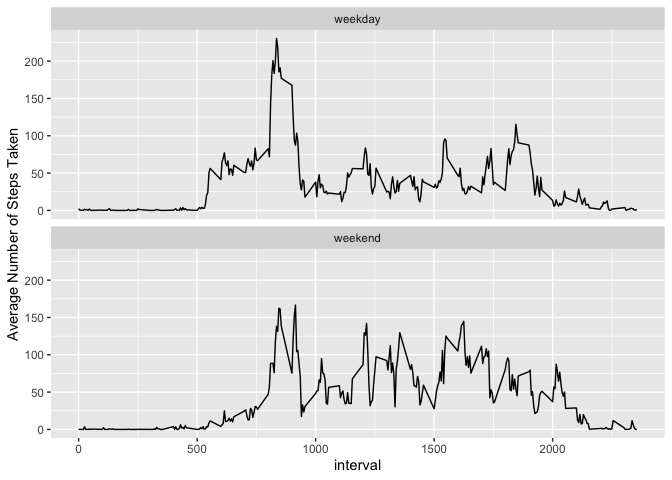

## Loading and preprocessing the data  
Load the data from the forked GitHub repository:  

```r
temp <- "./activity.zip"
unzip(temp, overwrite=TRUE)
activity <- read.csv ("./activity.csv", na.strings="NA")
```

Recognize the **date** variable as date:  

```r
activity$date <- as.Date (as.character(activity$date), "%Y-%m-%d")
```

## What is mean total number of steps taken per day?  
Using the **dplyr** package, group the data by date, and get the total number of steps taken each day:  

```r
library(dplyr)
```

```
## 
## Attaching package: 'dplyr'
```

```
## The following objects are masked from 'package:stats':
## 
##     filter, lag
```

```
## The following objects are masked from 'package:base':
## 
##     intersect, setdiff, setequal, union
```

```r
steps_day <- activity %>%
              group_by (date) %>%
              summarize (totalsteps=sum(steps))
hist (steps_day$totalsteps, 
      main="Histogram of Total Number of Steps Per Day", 
      xlab="Number of Steps Per Day")
```

<!-- -->

From the histogram, we can see that this participant was most likely to take 10,000 to 15,000 steps a day.   

Now get the mean and median of daily total numbers of steps:  

```r
mean (steps_day$totalsteps, na.rm=T)
```

```
## [1] 10766.19
```

```r
median (steps_day$totalsteps, na.rm=T)
```

```
## [1] 10765
```

## What is the average daily activity pattern?  
Group the data by interval, and get the average number of steps taken for each 5-minute interval:  

```r
steps_interval <- activity %>%
                    group_by (interval) %>%
                    summarize (avgsteps=mean(steps, na.rm=T))
plot (steps_interval$interval, steps_interval$avgsteps, 
      type="l")
```

<!-- -->

The plot indicates that this participant's activity level peaked sometime between 800 and 900 intervals.  

Now get the 5-minute interval at which the highest level of activity (number of steps) was measured:  

```r
max_index <- which.max (steps_interval$avgsteps)
steps_interval [max_index, ]
```

```
## # A tibble: 1 x 2
##   interval avgsteps
##      <int>    <dbl>
## 1      835     206.
```

## Imputing missing values  
First, let's check the total number of missing values in the dataset:  

```r
colSums (is.na(activity))
```

```
##    steps     date interval 
##     2304        0        0
```

A total of 2304 records are missing in the **steps** column, which represent 13% of the data. That's quite a bit, so we'll fill in those missing values using the average number of steps taken per each 5-minute interval:  

```r
new_activity <- left_join (activity, steps_interval, 
                           by="interval")
new_activity$steps <- ifelse (is.na(new_activity$steps), 
                              new_activity$avgsteps, 
                              new_activity$steps)
```

Create a new dataset that is equal to the original dataset but with the missing data filled in:  

```r
new_activity <- new_activity [ , c(1:3)]
```

With the new dataset, re-calculate the total number of steps taken each day, and create a histogram:  

```r
new_steps_day <- new_activity %>%
        group_by (date) %>%
        summarize (totalsteps=sum(steps))
hist (new_steps_day$totalsteps, 
      main="Histogram of Total Number of Steps Per Day (NAs filled)", 
      xlab="Number of Steps Per Day")
```

<!-- -->

The histogram reveals a very similar shape, with the most frequent range of 10,000 to 15,000 steps per day still dominating, and a bit more so with the new dataset.  

Now let's re-calculate the mean and median of total number of steps taken per day:  

```r
mean (new_steps_day$totalsteps)
```

```
## [1] 10766.19
```

```r
median (new_steps_day$totalsteps)
```

```
## [1] 10766.19
```

Before imputing the missing values, mean was slightly higher than median, which indicated a slightly right-skewed distribution. 
After imputing the missing values, mean and median are the same, which indicates the distribution is now symmetrical.  

## Are there differences in activity patterns between weekdays and weekends?  
First we need to create a factor variable distinguishing weekdays and weekends based on the **date** value:  

```r
new_activity$weekday <- ifelse (weekdays(new_activity$date) %in% 
                                        c ("Saturday", "Sunday"), "weekend", "weekday")
new_activity$weekday <- as.factor(new_activity$weekday)
```

Now we can get average number of steps taken for each 5-minute interval by weekday versus weekend:  

```r
avg_weekday <- group_by (new_activity, weekday, interval) %>% 
                summarize (avgsteps = mean(steps))
```

Create a plot comparing the activity level between weekdays and weekend:  

```r
library(ggplot2)
plot <- qplot (interval, avgsteps, data=avg_weekday, 
                geom="line", 
                facets=.~weekday, 
                ylab="Average Number of Steps Taken") +
                facet_wrap (~weekday, ncol=1, nrow=2)
print(plot)   
```

<!-- -->

From the plot, we can see that during weekdays, the participant is most active between 800 and 900 intervals, while during weekends, his/her activity is more evenly distributed throughout the day.  

